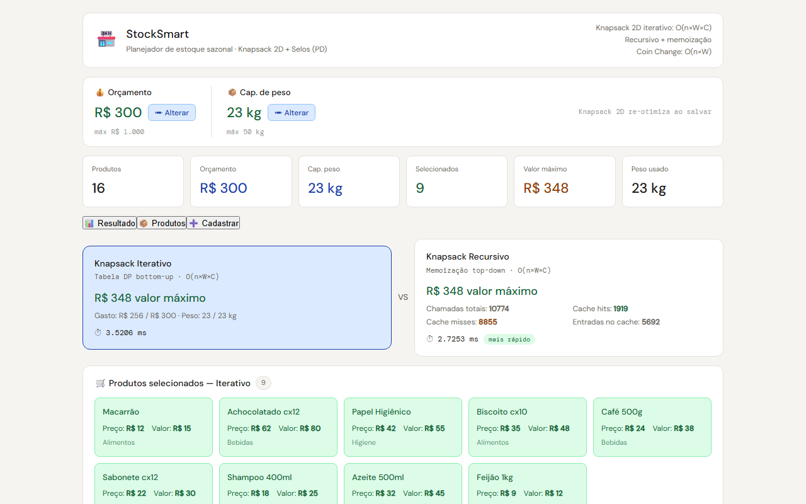
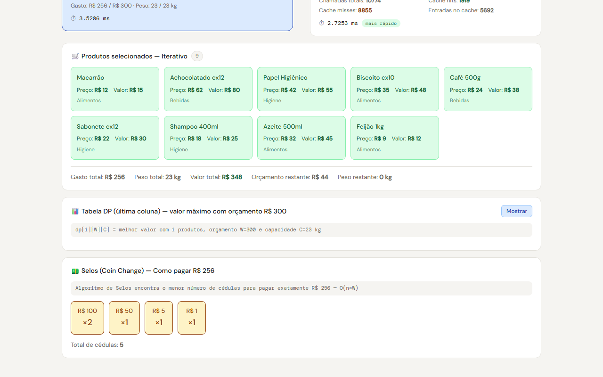

# StockSmart — Planejador de Estoque Sazonal

## Grupo 36

| Matrícula | Aluno                            |
| --------- | -------------------------------- |
| 231026616 | Davi Emanuel Ribeiro de Oliveira |
| 231026330 | Felipe Lopes Pedroza             |

## Apresentação

[](https://youtu.be/REM2ORCky6Q)

## Sobre

Aplicação web de planejamento de estoque sazonal que utiliza algoritmos clássicos de **Programação Dinâmica**. O **Knapsack 2D iterativo** escolhe quais produtos comprar para maximizar o valor dentro de um orçamento e capacidade de peso. O **Knapsack recursivo** resolve o mesmo problema com memoização top-down, permitindo comparação entre as duas abordagens. O **Coin Change** calcula como pagar o valor exato com o menor número de cédulas possível. Os três algoritmos rodam simultaneamente e o resultado é atualizado automaticamente sempre que um produto é cadastrado, editado, removido ou os parâmetros são alterados.

## Screenshots





## Quick Start

```bash
# Terminal 1 — Backend (porta 3001)
cd stocksmart/backend
npm install
npm run dev

# Terminal 2 — Frontend (porta 3000)
cd stocksmart/frontend
npm install
npm start
```

Acesse: **`http://localhost:3000`**

## Tecnologias

| Camada    | Tecnologia                        |
| --------- | --------------------------------- |
| Backend   | Node.js + Express.js              |
| Frontend  | React 18 (Create React App)       |
| HTTP      | Axios + proxy CRA → localhost:3001 |
| Algoritmos | Knapsack 2D (iterativo + recursivo) + Coin Change |

## Funcionalidades

- **Orçamento e capacidade de peso:** defina e altere os dois parâmetros a qualquer momento
- **Seleção ótima (Knapsack 2D):** escolhe automaticamente os produtos de maior valor respeitando orçamento e peso
- **Comparação iterativo vs recursivo:** mesma resposta, abordagens diferentes — número de chamadas, cache hits/misses e tempo de execução visíveis
- **Coin Change:** calcula o menor número de cédulas para pagar o valor exato gasto
- **Cadastrar produto:** nome, categoria, peso, preço e valor estimado
- **Edição inline:** edite preço, valor e peso diretamente na tabela
- **Re-otimização automática:** qualquer alteração dispara os três algoritmos sem precisar clicar

## Algoritmos

### Knapsack Iterativo 2D — O(n × W × C)

Constrói a tabela `dp[n+1][W+1][C+1]` de baixo pra cima, onde `W` é o orçamento e `C` é a capacidade de peso. Cada célula `dp[i][w][c]` representa o maior valor possível usando os primeiros `i` produtos com orçamento `w` e capacidade `c`. Ao final, rastreia quais produtos foram selecionados percorrendo a tabela de trás pra frente.

### Knapsack Recursivo 2D — O(n × W × C) com memoização

Resolve `solve(i, w, c)` recursivamente guardando subproblemas em um `Map`. Produz a mesma resposta que o iterativo mas de cima pra baixo. O frontend exibe o número total de chamadas, cache hits, cache misses e o tamanho do cache para comparação entre as duas abordagens.

### Coin Change — O(V × D)

`dp[v]` = menor número de cédulas para formar o valor `v`. Denominações disponíveis: R$1, R$2, R$5, R$10, R$20, R$50, R$100. Após o Knapsack decidir o gasto total, o Coin Change calcula como pagar esse valor exato com o mínimo de cédulas.

## Estrutura do Projeto

```
stocksmart/
├── backend/
│   └── src/
│       ├── server.js                       # API Express
│       ├── data/db.js                      # Produtos mockados + orçamento e capacidade em memória
│       ├── controllers/
│       │   ├── algoritmosController.js     # Knapsack iterativo, recursivo e Coin Change
│       │   └── stockController.js          # CRUD de produtos e parâmetros
│       └── routes/api.js                   # Rotas REST
└── frontend/
    └── src/
        ├── services/api.js                 # Chamadas axios ao backend
        ├── hooks/useStock.js               # Hook com re-otimização automática
        └── components/
            ├── PainelOrcamento.jsx         # Edição de orçamento e capacidade
            ├── FormProduto.jsx             # Cadastro de produto
            ├── TabelaProdutos.jsx          # Tabela com edição inline
            └── ResultadoAlgoritmos.jsx     # Resultado Knapsack + Coin Change
```

## API Endpoints

| Método | Endpoint            | Descrição                                      |
| ------ | ------------------- | ---------------------------------------------- |
| GET    | `/api/produtos`     | Lista todos os produtos e parâmetros atuais    |
| POST   | `/api/produtos`     | Cadastra novo produto                          |
| PUT    | `/api/produtos/:id` | Edita preço, valor e/ou peso de um produto     |
| DELETE | `/api/produtos/:id` | Remove produto                                 |
| GET    | `/api/otimizar`     | Roda Knapsack + Coin Change                    |
| PUT    | `/api/orcamento`    | Atualiza o orçamento `{ valor }`               |
| PUT    | `/api/capacidade`   | Atualiza a capacidade de peso `{ valor }`      |

## Pré-requisitos

- Node.js 14+
- npm
